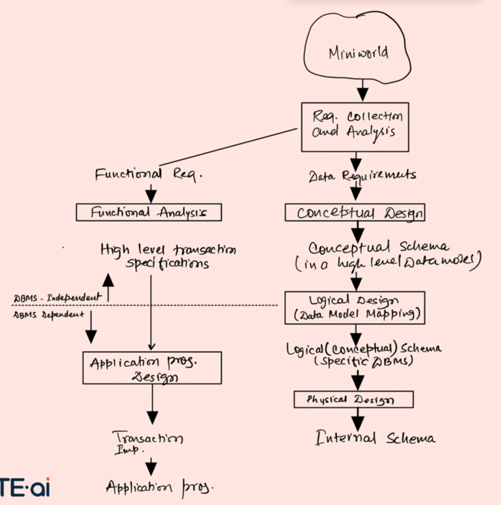

What is the database design whole process?

1.  First, client comes with an idea which we can call a mini-world application.
2.  We gather requirements from the client which can be functional or non-functional requirements and then analyze them.
3.  After analyzing we convert the data requirements into database conceptual design. We can do it by pen and paper or we can do it on a tool like Draw.io.
4.  We can now convert our conceptual schema into database logical design which consist of all the relationships and entities.
5.  At the end the logical design is converted into the physical design.

Tools use to design the database

1. MYSQL WorkBench
2. Moon Modeler
3. Eraser

Process of designing the database

1. Start by listing all the entities in your application.
2. Write down the attributes for each entity.
3. As you list the attributes, you will naturally see how the entities are connected. Add the IDs of related entities at that point.
4. Define the relationships between the entities clearly.
