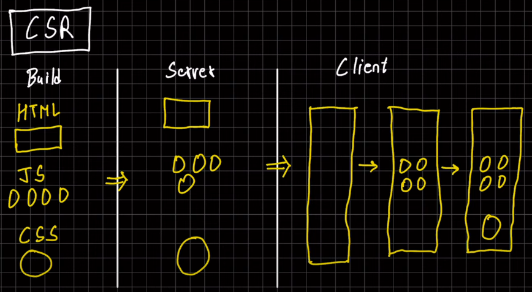
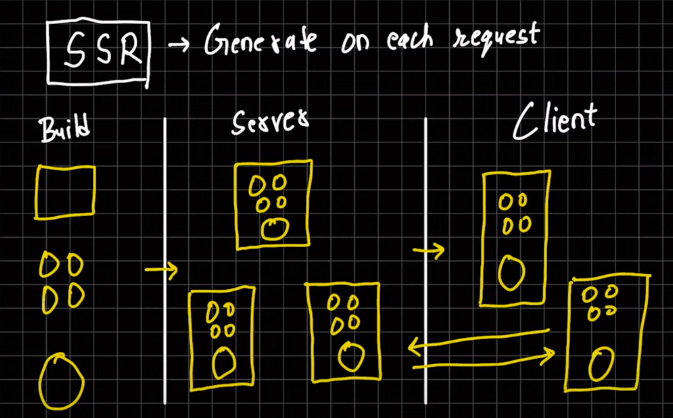
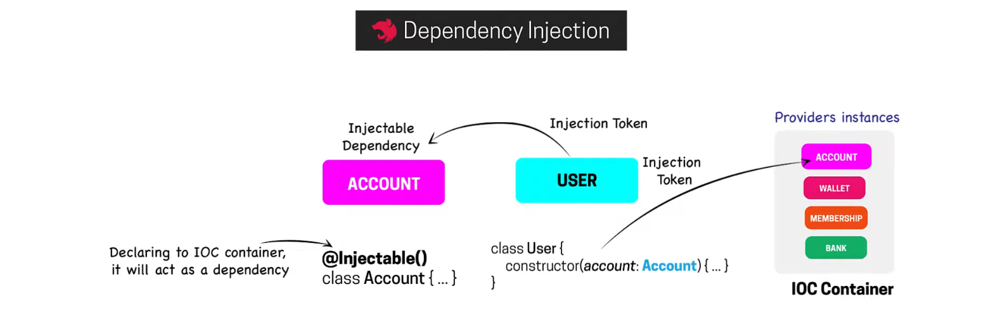

What is Node JS?  
Node JS is neither a language nor a framework. It is a runtime environment for executing Javascript code on the server-side. The runtime environment is responsible for memory management and conversion of high language code to machine language code. So,  
Express JS is a framework that uses Node JS to execute Javascript code on the server side.

What is a framework?  
A framework is a wrapper over the runtime environment. Which eases the development process by providing built-in methods.

How does Javascript run on client-side and server-side?  
On client-side browsers use the V8 engine to run Javascript code. On the server-side Node JS uses the V8 engine to run Javascript code.

How does a network request from client-side to the browser-side work?  
A user opens a browser and hits the client-side server. If the data is already present there he can perform basic operations on the client-side like filtering, sorting... If the data is not present on the client-side then the request will go to the server-side  
where Node JS and Express JS check the request and then fetch the data from the database and sends it to the client-side which is then presented to the UI on the browser.

Main features of Node JS?

1. Single Threaded
2. Event-Driven Architecture
3. Asynchronous
4. Real-Time Capabilities

What is single-threaded?  
A single-threaded operation performs only one task at a time.

How does Node JS handle multiple tasks if it is a single-threaded language?  
In Node.js, asynchronous flow can be achieved by its single-threaded, non-blocking, and event-driven architecture.  
Suppose,  
If there are 4 tasks (Task1, Task2, Task3, Task4) to be completed for an event. Then below steps will be executed:  
First, Thread T1 will be created.  
Thread T1 initiates Task1, but it won't wait for Task1 to complete. Instead, T1 proceeds to initiate Task2, then Task3 and Task4 (This asynchronous execution allows T1 to efficiently handle multiple tasks concurrently).  
Whenever Task1 completes, an event is emitted.  
Thread T1, being event-driven, responds to this event, interrupting its current task and delivering the result of Task1. And then proceeds with whatever it is doing.

When not to use Node JS?  
It would be best not to use Node JS when the application demands CPU-intensive tasks like image/ video processing.

What is a Module in Node JS?  
A module is a specific functionality (like orders, payments, shipping) that can be easily reused within an application.  
Ideally, In Node JS we represent individual files as modules.

How many ways are there to export module data?  
We can export module data in two ways.

1. module.exports.myFunction = myFunction;
2. exports.myFunction = () => console.log("Hello world")

How to import module data?  
const moduleData = require('./moduleData');

What is the module wrapper function?  
In Node JS each module is wrapped in a function called the module wrapper function. Such that app.js is wrapped in a function and  
when we run node app.js the file is executable.

How many types of modules are there in Node JS?  
There are three types of modules in Node JS.

1. Built-in Modules (File, HTTP, Path, Math)
2. Local Modules (Which we develop in our project)
3. Third-Party Modules (Lodash)

Explain how the request is handled from the back-end side?  
When a request is generated from the front-end server upon receiving it from the back-end server an event is created and for that particular event, a function  
is triggered after the completion of that function a response is sent back to the front-end server.

What is the role of the HTTP module in Node JS?  
An HTTP module creates an HTTP server that listens to HTTP requests.

List some of the advantages of Express JS?

1. Simplified Web Development
2. Middleware Support
3. Flexible Routing System
4. Template Engine Integration

What is a middleware?  
A middleware is a function that handles HTTP requests, performs operations on it, and passes the control to the next middleware in line.

What is the role of app.use() method?  
The app.use(middleware) method is used to execute the middleware functions globally (for every request).

What is the role of the next parameter?  
The next parameter is a callback function which is used to pass control to the next middleware function in the stack.

What is a request pipeline in Express JS?  
A request pipeline contains multiple middleware functions in line.

How many types of middleware are there?

1. Application Level app.use(middleware);
2. Router Level app.use('/example', middleware);
3. Error-handling app.use((err,req,res,next)=>{});
4. Built-in app.use(express.static("public"));
5. Third-party app.use(bodyParser.json());

If you have 5 middleware then in which middleware you will do the error handling?  
I will do the error handling in the last middleware because suppose the error is generated in the 3 middleware and our error middleware is located at the second position  
and when the Node tries to trigger the error middleware it will not be able to find the error middleware.

Example of routing in Express JS?  
app.get('/orders/:orderId', (req,res)=>{});  
or  
app.get('/orders/:orderId', ordersController.getOrderById);

What is a router method? And why do we need it?  
A router method is imported from express and by using it we can export our routes from a separate file.  
const router = express.Router();  
router.get('/orders/:orderId', (req,res)=>{});

module.exports = router;  
and we can import it by using this syntax  
const router = require("./router");  
app.use("/api", router);

Differences between app.get() and router.get() methods?

1. The app.get() method defines routes automatically on the application object while router.get() method is used to define routes on router object.
2. Routes defined using app.get() are automatically mounted on the root path "/" while routes defined using router.get() must be explicitly mounted using app.use() method.
3. The app.get() is not modular and does not support reusability while router.get() method is modular and supports modularity.

What is route chaining?  
Defining multiple middlewares for a single route is called route chaining.

What is route nesting?  
Route nesting organize routes by grouping them under a common URL prefix.
like /users/profile.
We can achieve this behavior by mounting router methods with app.user("/users", usersRouter);

What are template engines?  
Template engines are used to combine static HTML with the data on the server side.

    1. EJS (Embedded JavaScript)
    2. Handlebars
    3. Pug

What is REST?  
REST stands for Representational State Transfer. Meaning transfer of data in a meaningful way. It is basically set of rules for transferring the data.

    1. Separation of Client and Server
    2. Stateless (The server should not store the data)
    3. Uniform Interface (Unique Endpoints)
    4. Cacheable (The response can be cacheable for similar requests)
    5. Layered Systems (MVC)

What is RESTful API?  
An API which follows rest principles.

What are HTTP methods and HTTP verbs?  
GET, POST, PUT, DELETE and PATCH are known as HTTP methods or HTTP verbs.

What is the difference between PUT and PATCH method?  
The PUT method is used to update the resource completely or create a new one if not exists but PATCH method updated the resource partially.

What is Idempotence in RESTful API's?  
Idempotence means performing an operation multiple times will have the same output.
Idempotence methods are GET, PUT, PATCH, DELETE while POST is not idempotent.

HTTP Status Codes
1XX (Info):

- 100: Continue

2XX (Success):

- 200: OK
- 201: Created
- 202: Accepted
- 204: No Content

3XX (Redirection):

- 300: Multiple Choices

4XX (Client Error):

- 400: Bad Request
- 401: Unauthorized
- 403: Forbidden
- 404: Not Found

5XX (Server Error):

- 500: Internal Server Error
- 501: Not Implemented
- 502: Bad Gateway
- 503: Service Unavailable

What are CORS?  
CORS stands for Cross Origin Resource Sharing. Meaning you are only allowed to fetch the data from the same domain.

What is Serialization and Deserialization?  
Serialization means the conversion of the JS object to JSON format. Deserialization is the vice versa.  
const JSONStr = JSON.stringify(obj);  
const obj = JSON.parse(JSONStr);

Types of Authentication

    1. Basic Authentication (password as plain text)
    2. API Key Authentication (API key is sent with the headers)
    3. Token Based Authentication (JWT) (Token is sent with the headers) (Contains Header, Payload and Signature)
    4. Multi-factor Authentication
    5. Certificate-based Authentication

Handle Errors in Node JS

    1. Try Catch
    2. Error First Callbacks
    Passing error method as a callback to a function
    const errorFirstCallback = (error, result) => {};
    const asyncOperation = (callback)=>{};
    asyncOperation(errorFirstCallback);
    3. Using Promises
    4. Using Async/ Await and Try/Catch

Difference between Async and Worker threads?
Async is used for time consuming tasks like API calling while worker threads are used for high computational tasks which require processing power like data processing.

What are clusters in Node JS?  
Clusters in Node JS are used to run multiple instances of Node JS that can distribute workloads among their application threads. Every instance of Node JS is then called a worker thread. The count of worker threads depends on the number of cores in the CPU. The primary cluster works as a load balancer that assigns tasks to other worker threads.
The algorithm it used to assign tasks to worker threads is Round Robin algorithm (1234,1234,1234)

```javascript
const cluster = require("cluster");
const os = require("os");
const express = require("express");

const PORT = 8000;
const totalCPUs = os.cpus().length;

if (cluster.isPrimary) {
  for (let i = 0; i < totalCPUs; i++) {
    cluster.fork();
  }
} else {
  const app = express();
  app.get("/", (req, res) => {
    return res.json({
      message: `Hello from Express Server ${process.pid}`,
    });
  });

  app.listen(PORT, () => {
    console.log(`Server Started At Port ${PORT}`);
  });
}
```

Difference between CSR, SSR?
In Build Process, first the source code gets build and the files gets stored on the server. Later, the data is sent to the client side.

In Client-Side Rendering (CSR), an empty HTML shell is sent to the client, followed by JavaScript files. The JavaScript then dynamically generates the HTML, applies CSS, and loads content, enabling the page to render. For SEO purposes it is not good as search engines might not fully load JavaScript, seeing an empty page instead of important content.



In Server-Side Rendering the web page gets rendered on the server and the rendered web page is sent to the client-side. Every time a user request something from the server a rendered web page is sent to the client-side. As the server is really powerful as compared to client computers or mobile devices the web pages gets rendered quickly.



How to optimize the SQL query?

1. Use idexing for searching or for commonly used columns in where conditions.
2. Try to avoid the use of SEELCT \*
3. Try to use varchar/ nvarchar instead of char as char adds trailing spaces.
4. Use numeric fields to store numeric values.
5. Try to minimize the use of DISTINCT keyword.
6. Try not to use the <> or != operator instead use the equality operator for better indexing.
7. Use EXISTS() keyword instead of COUNT() to discover whether the table has a specific record otherwise it will scan the whole table.

Queues In Node JS

Queues are used to run a backend task asynchronously. They’re essential for managing operations that can’t be completed instantly.
Mostly Message Queues and Task Queues are used.

1. Task Queues are used to manage and execute background jobs within the same application, often for things like sending emails, processing images, or handling long tasks. We basically pushed the tasks onto a queue and that task will run seperately after some time intervals.

2. Message Queues are used to send messages between different services or applications, allowing them to communicate without being directly connected.

What is Dependency Injection?
Dependency Injection allows the application to inject a class dependencies into another class whenever the framework needed the instance. The class/ service that is injected act as a dependency to the other class. It depends on the IOC (Inversion Of Control) Principle. The control to manage the application is handed over to the Framework. The IoC container holds all injectors, which use providers to define how dependencies (classes or services) are created or retrieved. The class that wants to inject the other class will use the injection token to import the dependencies.



Types of the Dependency Injections

1. Constructor Injection
2. Propery Injection

Authentication Process in MERN stack?
In a MERN stack authentication process, users register by sending credentials (like email and password) from the React frontend to the Node.js/Express backend, where passwords are securely hashed (e.g., using bcrypt) before being stored in MongoDB. During login, credentials are verified, and upon success, the backend generates a JWT (JSON Web Token) using a secret key, which is sent back to the frontend. The frontend stores the token (preferably in an HTTP-only cookie or local storage) and includes it in subsequent requests for accessing protected resources. On the backend, middleware validates the token, ensuring authorized access to specific routes. Logout involves clearing the token on the client side.

What happens when someone changes the token.
A JWT token is created based on the header + payload + secret key. The token contains the following parts: header, payload, and signature. If someone changes the payload with their own secret key, then it will result in a new signature for the token. When this modified token is sent to the server, the server recalculates the signature using the token's header + payload and the server's own secret key. The recalculated signature is then compared with the signature in the token that was sent to the server. If the signatures do not match, the server identifies the token as tampered or invalid and rejects it.

What are Http-only Cookies?
HTTP-only cookies are cookies with the HttpOnly attribute.
They cannot be accessed via client-side JavaScript, reducing the risk of XSS attacks where malicious scripts attempt to steal sensitive data stored in cookies.
HTTP-only cookies are stored in the browser's cookie storage, not in localStorage or sessionStorage.

When the server sets an HTTP-only cookie, it sends it in the Set-Cookie header as part of the response.

```javascript
res.cookie("token", jwtToken, {
  httpOnly: true,
  secure: true, // Only over HTTPS
  sameSite: "Strict", // CSRF protection
  maxAge: 3600000, // Cookie expiry in milliseconds
});
res.json({ message: "Logged in successfully" });
```

Once the cookie is set, the browser automatically attaches it to all subsequent requests.

```javascript
const token = req.cookies.token; // Extract token from HTTP-only cookie
```

What is CSRF attack?
A CSRF (Cross-Site Request Forgery) attack happens when a hacker takes advantage of your active session with the website to perform actions as if you were doing them yourself.

Use csurf or use the same-site attribute to prevent from these attack

```javascript
const csrf = require("csurf");
const csrfProtection = csrf({ cookie: true }); // Use with cookies
app.use(csrfProtection);
```

What is Rate Limiting?
Rate limiting is a technique used to control the number of requests a client (e.g., IP address, user) can make to a server within a specific period. It helps prevent abuse or overuse of APIs, protects against DDoS (Distributed Denial-of-Service) attacks, and ensures fair use of resources.
Each request is identified by a unique key (e.g., IP address, user ID). The server keeps track of the number of requests made by this key.

What is a DDoS Attack?
A DDoS (Distributed Denial-of-Service) attack is a malicious attempt to disrupt the normal operation of a server, service, or network by overwhelming it with a flood of internet traffic.

What is Refresh Token?
When a JWT is initially generated, a Refresh Token is also created and sent to the client. The client securely stores the JWT and Refresh Token—ideally, the Refresh Token in an HttpOnly cookie to protect against XSS attacks. For each subsequent request, the client includes the JWT in the request header (typically as a Bearer token) for authentication.
If the JWT expires, the client sends the Refresh Token in a secure request (such as via an HttpOnly cookie) to the server to request a new JWT. The Refresh Token typically has a longer expiration period compared to the JWT
